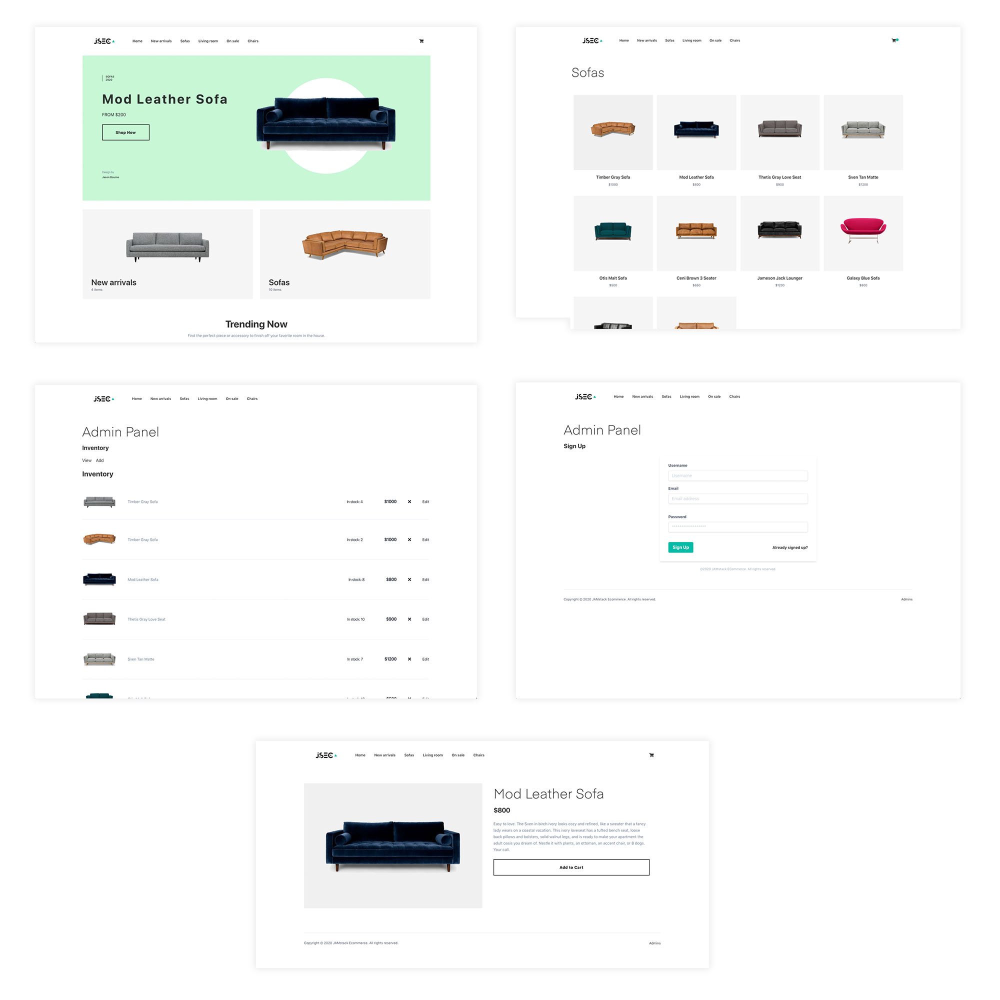

## JAMstack ECommerce Site

Out of the box, the site uses completely static data coming from a provider at `providers/inventoryProvider.js`. You can update this provider to fetch data from any real API by changing the call in the `getInventory` function.



### Getting started

1. Clone the project

```sh
$ git clone https://github.com/jamstack-cms/jamstack-ecommerce.git
```

2. Install the dependencies:

```sh
$ yarn

# or

$ npm install
```

3. Run the project

```sh
$ gatsby develop

# or to build

$ gatsby build
```

## Technology Used

### Tailwind

[Tailwind](https://tailwindcss.com/docs) is used for styling.

### Components

The main files, components, and images you may want to change / modify are:

__Logo__ - src/images/logo.png   
__Buttons, Nav, Header__ - src/components   
__Form components__ - src/components/formComponents   
__Context (state)__ - src/context/mainContext.js   
__Pages (admin, cart, checkout, index)__ - src/pages   
__Templates (category view, single item view, inventory views)__ - src/templates   

### CMS

As it is set up, inventory is fetched from a local hard coded array of inventory items. This can easily be configured to instead be fetched from another CMS or data source by changing the inventory provider.

### Updating Auth / Admin panel

1. Update __src/pages/admin.js__ with sign up, sign, in, sign out, and confirm sign in methods.

2. Update __src/templates/ViewInventory.js__ with methods to interact with the actual inventory API.

3. Update __src/components/formComponents/AddInventory.js__ with methods to add item to actual inventory API.
